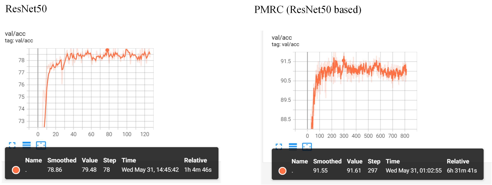

# Fine-grained Image Classification
Weakly Supervised Posture Mining for Fine-grained Classification

We designed a new pipeline for PMRC, to a certain extent, added the function of discriminant area alignment. PMRC is an idea: mine the discriminative area, construct the poseture, and use the poseture information to enhance the discriminative ability.

Regarding the RCE, we are waiting for the check result from IEEE, meanwhile, we sincerely recommend everyone to know the work[1] from NeruIPS2018.

Posture Mining on CUB-200-2011[2]:


The trained model in ckpt, and comparison of resnet50 and PMRC (based on resnet50) on valset:


The trained PMRC (based on ResNet50):

链接：https://pan.baidu.com/s/1sL2WMjbnmhL-9WeaVLPolg?pwd=2pkd 
提取码：2pkd

The trained resnet50:

链接：https://pan.baidu.com/s/1odHE5XfJJKQWX4tvr-IV_A?pwd=7lvu 
提取码：7lvu

### Citations

[1] Towards robust detection of adversarial examples
```bibtex
@article{pang2018towards,
  title={Towards robust detection of adversarial examples},
  author={Pang, Tianyu and Du, Chao and Dong, Yinpeng and Zhu, Jun},
  journal={Advances in neural information processing systems},
  volume={31},
  year={2018}
}
```

[2] CUB-200-2011:
```bibtex
@techreport{WahCUB_200_2011,
	Title = ,
	Author = {Wah, C. and Branson, S. and Welinder, P. and Perona, P. and Belongie, S.},
	Year = {2011}
	Institution = {California Institute of Technology},
	Number = {CNS-TR-2011-001}
}
```
